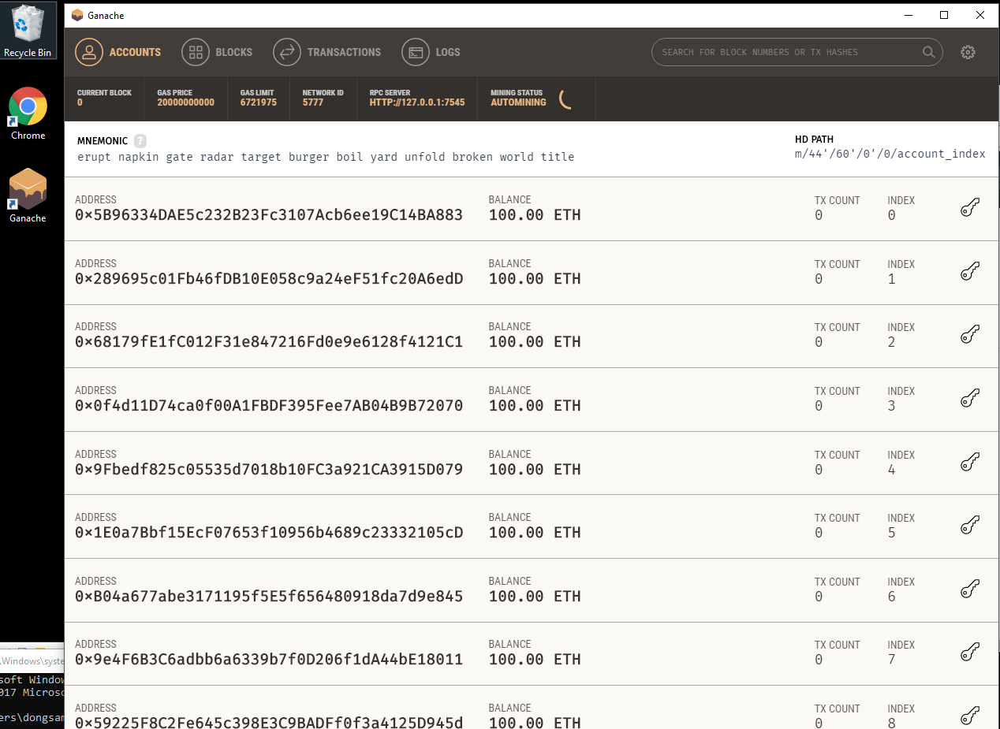

#Ganache

[Ganache](http://truffleframework.com/ganache/) 에서 OS 에 따라 받을 수 있으며 

https://github.com/trufflesuite/ganache/releases 에서 더 다양한 형식으로 다운로드, 설치 가능

- Windows 

	

	Windows 의 경우 .APPX 형태로 설치가 불가능 한 경우 [여기](https://github.com/trufflesuite/ganache/releases) 서 ganache-setdup-x.x.x.exe 을 통해 설치 후 실행 가능

	

	​	

- Ubuntu

	

	- AppImage 형태로 다운로드 후, 터미널에서 실행 권한을 준 후 실행 가능하다.
		- test@test:~/Downloads$ chmod +x ganache-1.1.0-x86_64.AppImage
		- test@test:~/Downloads$ ./ganache-1.1.0-x86_64.AppImage 

	

- Mac

	- .dmg 혹은 .app 형태로 설치 후 실행 가능

		

- ganache-cli

	GUI 형태가 아닌 CLI 형태로(구 TestRPC) 사용이 필요하면 npm 이 설치된 환경에서 `npm install -g ganache-cli` 명령을 통해 설치 후 `ganache-cli` 명령을 통해 사용 가능

	

