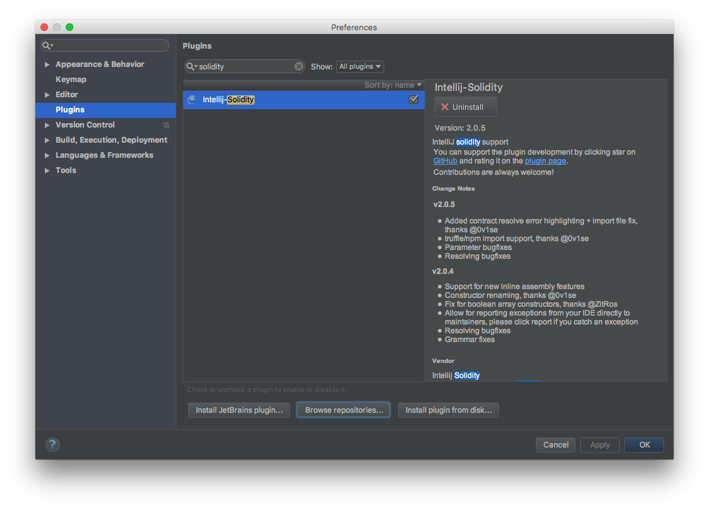
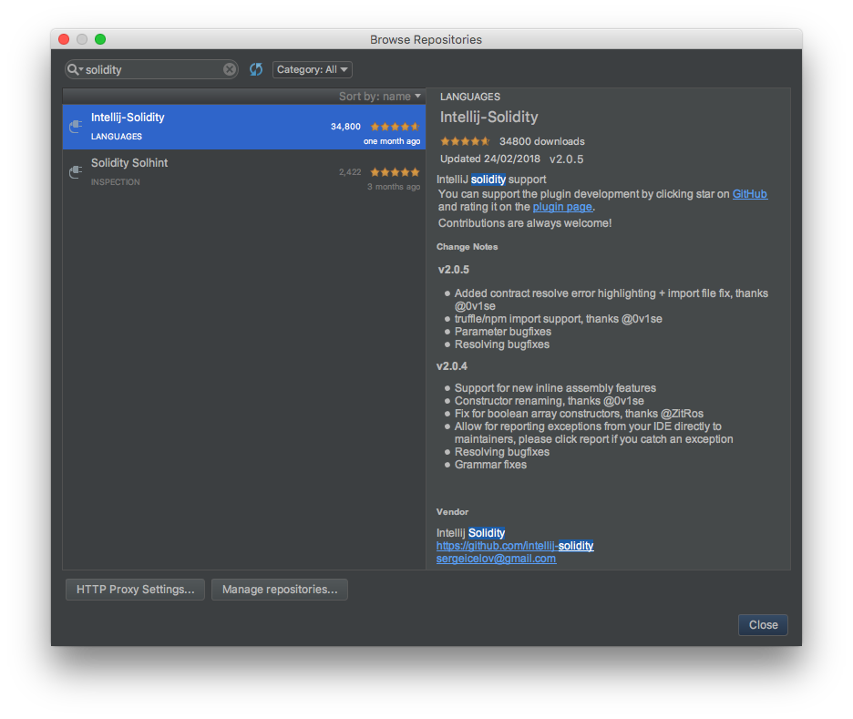

# IntelliJ

https://www.jetbrains.com/idea/ 링크를 통해 OS에 맞게 Community( open source, free ) 버전 다운로드 및 설치 

- Jetbrain 계열의 타 IDE ( Webstorm, Pycharm 등도 License 가 있다면 사용 가능 )

### Intellij-Solidity Plugin 설치

- IntelliJ 혹은 Jetbrain 계열 IDE 설치 완료 후 
- 설정에서 Plugins 을 선택하여 `solidity` 검색
	-  
	- `Intellij-Solidity` 가 결과로 나온다면 선택하여 Install
	- 결과가 나오지 않는다면 `Browse repositories...` 를 선택하여 재검색 하여 아래와 같이 설치
	- 

상세 정보는 아래 링크 참고

- https://plugins.jetbrains.com/plugin/9475-intellij-solidity

- https://github.com/intellij-solidity/intellij-solidity