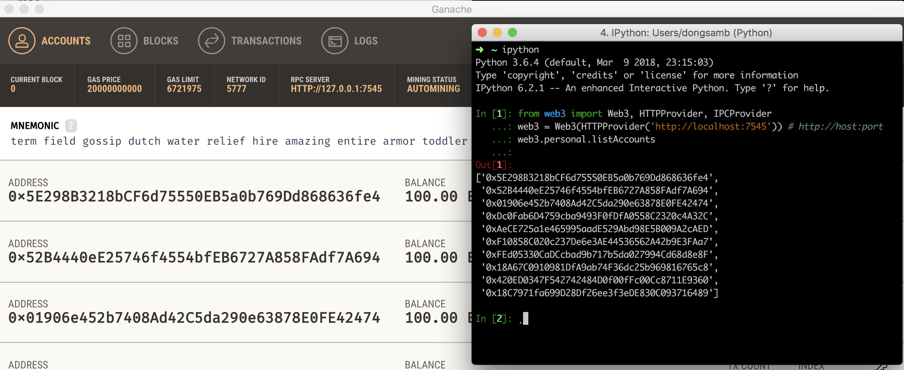

# Mac

mac 의 경우 python 이 기본적으로 2.7.x 버전 만이 깔려있기 때문에, 별도로 python3.5+ 버전을 설치한 경우가 아니라면 anaconda 를 통해 설치할 것을 권장


# web3.py 설치

- `pip install web3==4.0.0` 명령을 통해 에러 없이 설치되는것을 확인한다. 

	- pip 이 python 2에 연결되어있고 python3 등이 별도로 존재하는 경우  pip3 로 시도 혹은 `python -m pip install web3==4.0.0` 등으로 시도 가능

- 설치 완료 후 ganache 혹은 geth 노드를 실행 후 ipython 을 통해 아래와 같이 web3 연동 및 account 조회를 시도하여 정상적으로 뜨는것을 확인

  ```python
  from web3 import Web3, HTTPProvider, IPCProvider
  web3 = Web3(HTTPProvider('http://localhost:7545')) # http://host:port
  web3.personal.listAccounts
  ```

- 

