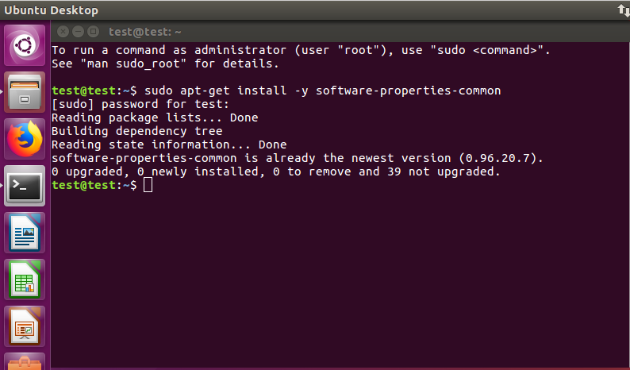
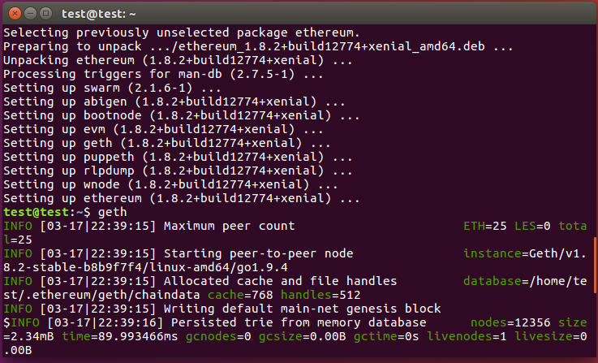

# Ubuntu

DApp 개발 및 Remix 등 사용을 위해 Browser 환경이 필요하여 Server 형이 아닌 Ubuntu Desktop  16.04 LTS 버전 기준으로 진행

Terminal 에서 아래 명령 차례로 입력

- sudo apt-get install -y software-properties-common
- sudo add-apt-repository -y ppa:ethereum/ethereum
- sudo apt-get update
- sudo apt-get install -y ethereum

설치 후 `geth` 명령 실행 시 위와 같이 Ethereum Node 가 실행되면 정상적으로 설치 완료 

상세 사항은 아래 링크 참고

- https://github.com/ethereum/go-ethereum/wiki/Installing-Geth

