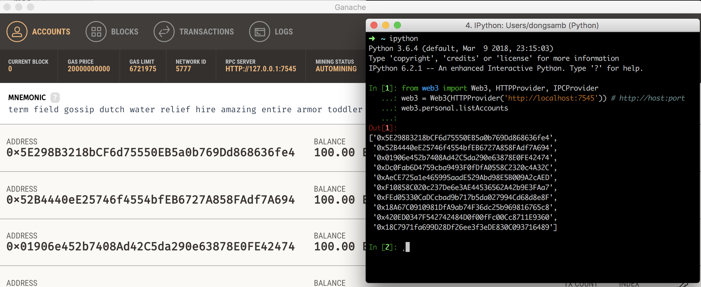

# Ubuntu

Ubuntu 의 경우 16.04 기준으로 python 3.5.2 버전이 설치되어 있으므로 별도 anaconda 추가 설치 없이 CLI 환경에 익숙하다면 apt-get 을 통해 pip, ipython, jupyter 등 만 추가 설치해도 무방


그게 아니라면 Anaconda 공식 웹사이트를 통해 다운받은 `chmod +x Anaconda3-5.x.x-Linux-xxx_xx.sh` 명령 을 통해 실행 권한을 준 후 `./Anaconda3-5.1.0-Linux-x86_64.sh` 를 통해 실행시켜 설치해준다.


자동으로 bin path 가 등록되지 않으므로 anaconda 가 설치된 directory_path/bin 을 export 등에 포함시켜주거나, python, pip, ipython, jupyter-notebook 등만 별도로 alias 등을 설정하여 사용한다.

​	ex)   `PATH="$HOME/anaconda3/bin:$PATH"`


# web3.py 설치

- `pip install web3==4.0.0` 명령을 통해 에러 없이 설치되는것을 확인한다. 

	- pip 이 python 2에 연결되어있고 python3 등이 별도로 존재하는 경우  pip3 로 시도 혹은 `python -m pip install web3==4.0.0` 등으로 시도 가능

- 설치 완료 후 ganache 혹은 geth 노드를 실행 후 ipython 을 통해 아래와 같이 web3 연동 및 account 조회를 시도하여 정상적으로 뜨는것을 확인

  ```python
  from web3 import Web3, HTTPProvider, IPCProvider
  web3 = Web3(HTTPProvider('http://localhost:7545')) # http://host:port
  web3.personal.listAccounts
  ```

- 

