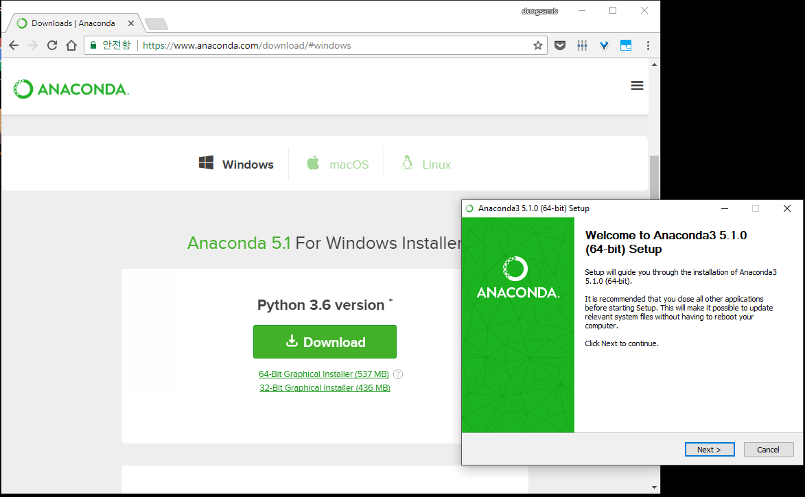
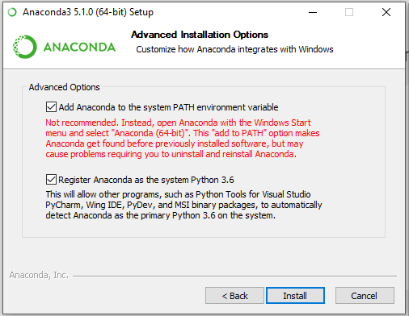
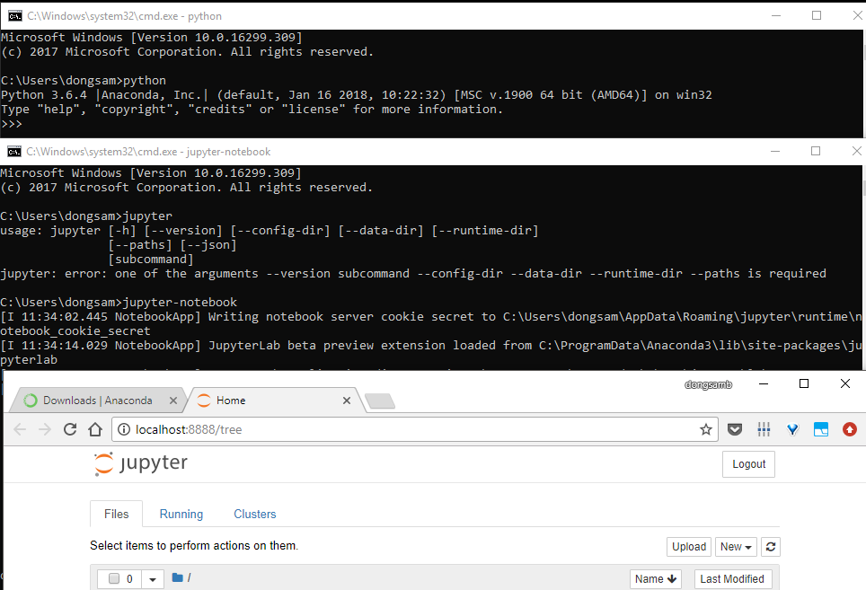
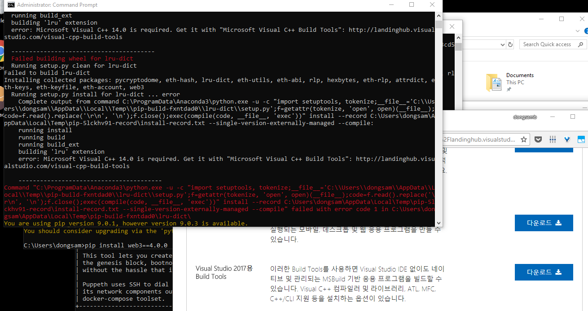
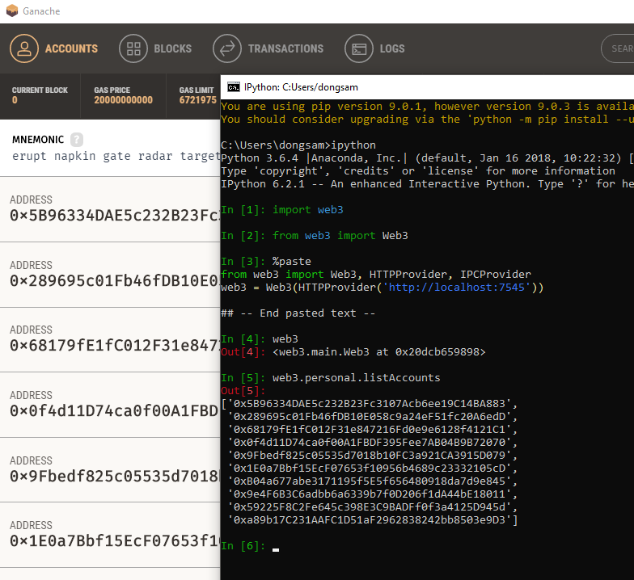

# Windows

설치 후 `cmd` 에서 `python` 명령을 쳤을 때 아래와 같이 Python 3.6.x 버전대가 실행되고, `jupyter-notebook` 명령을 통해 jupyter 서버 가 실행되어 `http://localhost:8888` 를 통해 jupyter 에 접근가능하면 성공

# web3.py 설치

- `pip install web3==4.0.0` 명령을 통해 에러 없이 설치되는것을 확인한다. 
- error: Microsoft Visual C++ 14.0 is required. Get it with "Microsoft Visual C++ Build Tools": http://landinghub.visualstudio.com/visual-cpp-build-tools
	- 위와 같은 에러가 뜨면 위 링크를 통해 Build Tools 를 설치 후 재시도 ( SDK option 등 도 포함하여 설치 [ref](https://stackoverflow.com/questions/40018405/cython-cannot-open-include-file-io-h-no-such-file-or-directory))
	- 

설치 완료 후 ganache 혹은 geth 를 실행 후 ipython 을 통해 위와같이 web3 연동 및 account 조회를 시도해본다. 