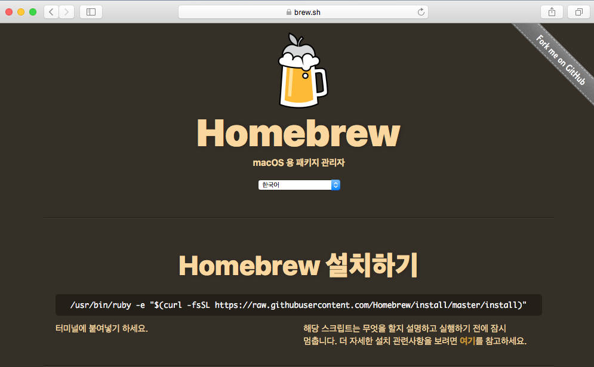
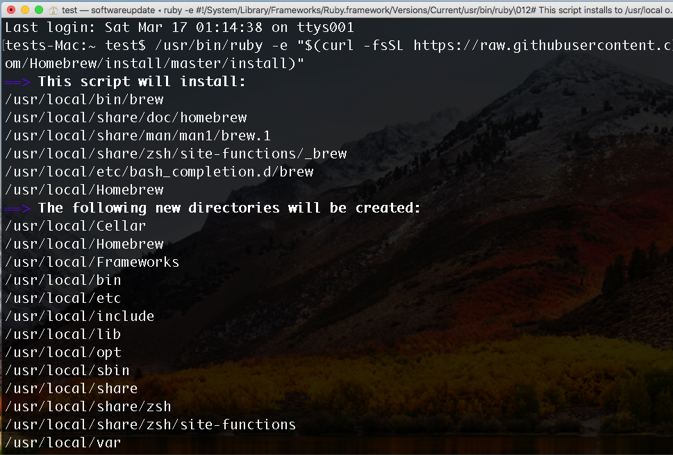
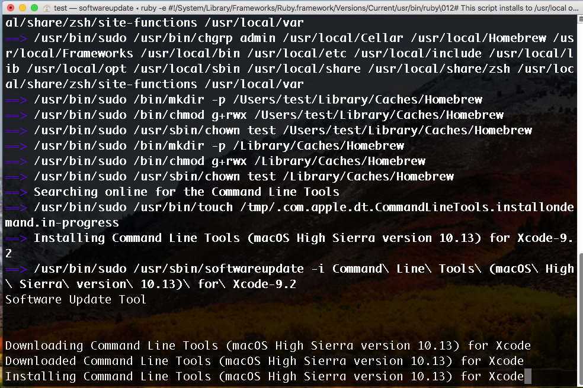
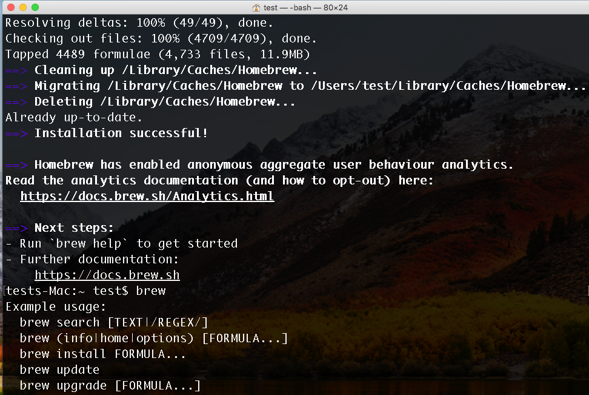
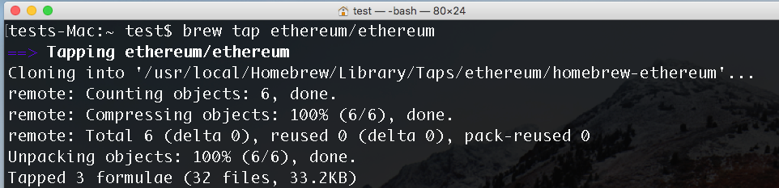
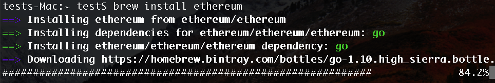
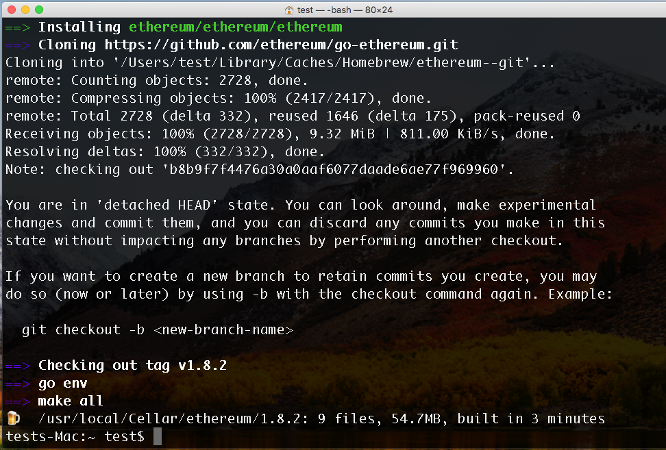
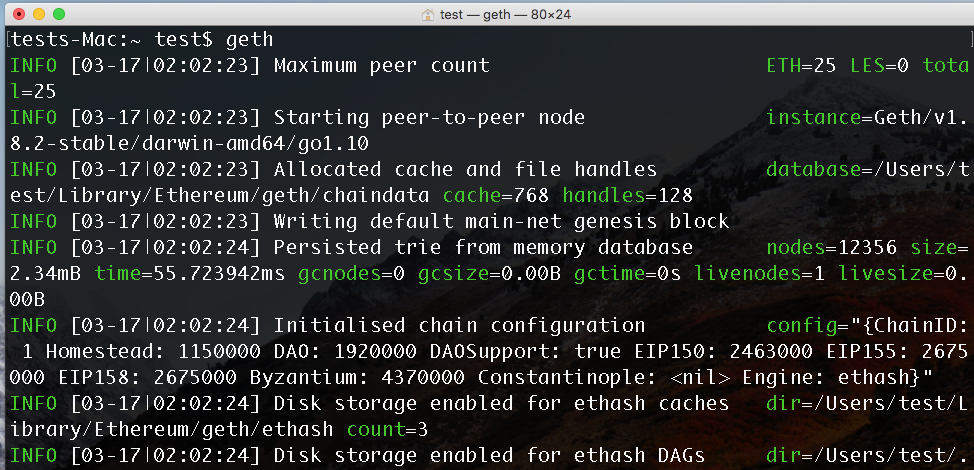
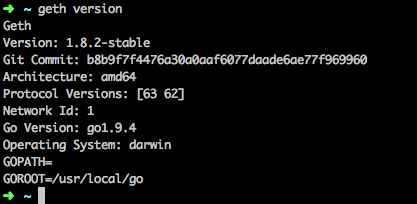

# Mac

## Geth 설치 

### Install Homebrew

Hombrew 는 Ubuntu 의 apt-get 과 같은 MacOS 의 Package 설치, 관리 Tool 이다.

Hombrew 를 통해 Geth 를 설치

[https://brew.sh](https://brew.sh/index_ko) 방문

`/usr/bin/ruby -e "$(curl -fsSL https://raw.githubusercontent.com/Homebrew/install/master/install)"`

터미널에 위 명령 copy 하여 실행

정상적으로 설치 중인 모습

깔려있지 않다면 Xcode 의 Command Line Tools 도 같이 설치 된다.

설치 완료 된 모습.

정상적으로 설치되었다면 `brew` 명령을 실행해 보았을 때 위 같은 결과를 볼 수 있다.

### Geth 설치

`brew tap ethereum/ethereum`  명령을 통해 brew 에 ethereum 저장소를 추가

`brew install ethereum`   명령을 통해 ethereum 설치

정상적으로 설치가 완료되면 아래와 같은 화면을 볼 수 있다.

`geth` 명령을 실행시켜 아래와 같이 Ethereum Node 가 구동되는 것을 확인 할 수 있다. 

상세 사항은 https://github.com/ethereum/go-ethereum/wiki/Installation-Instructions-for-Mac 를 참고

### Geth Upgrade

위 처럼 `geth version` 명령을 통해 현재 설치된 geth 의 버전을 확인 할 수 있다.  

geth 의 버전은 꽤나 빠르게 업데이트 되가고 있다. 혹시 최신버전의 Geth 가 출시되어 업드레이드가 필요할 시 아래와 같이 시도해 볼 수 있다.

`brew tap ethereum/ethereum`
`brew update`
`brew reinstall ethereum`  혹은 `brew upgrade ethereum`

그러나 위 같이 시도했음에도 불구하고 `geth version ` 을 했을 때,  기존과 같은 구버전이 나오는 케이스가 있다.

그럴 땐 https://geth.ethereum.org/downloads/ 에 방문하여 OS 에 맞는 파일을 받아 압축을 푼 후, 확인 수 있는 binary 파일을 기존 geth 가 설치된 위치에 덮어씌기 해주면 된다.

- `which geth` 명령을 통해 설치 된 geth 의 Location 을 확인 할 수 있다.
	- ex) `/usr/local/bin/geth`

