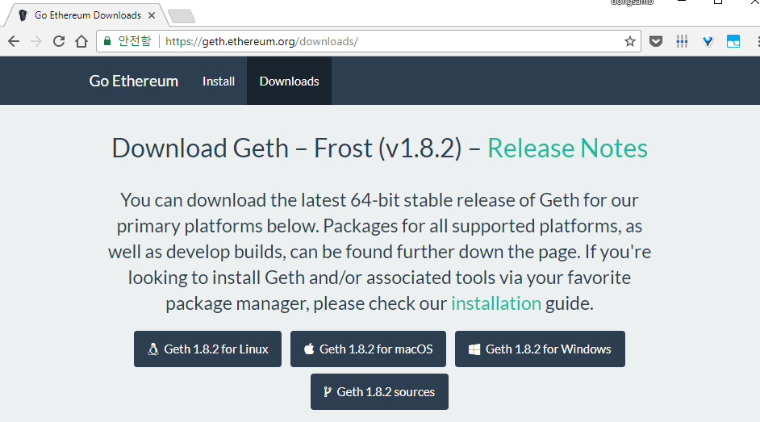
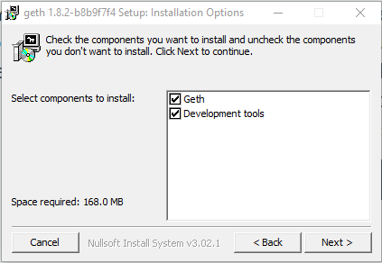
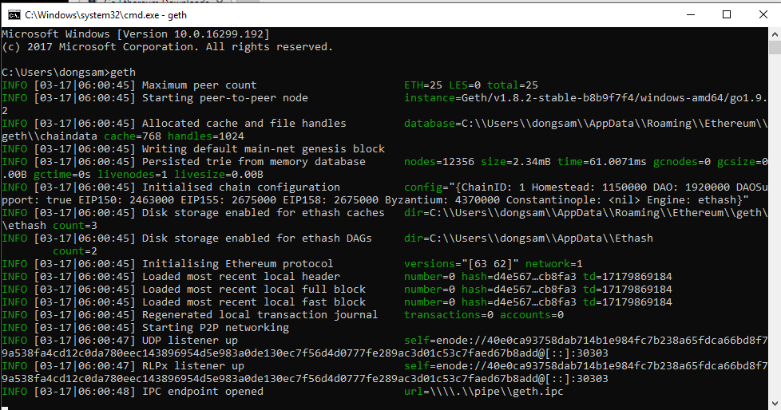
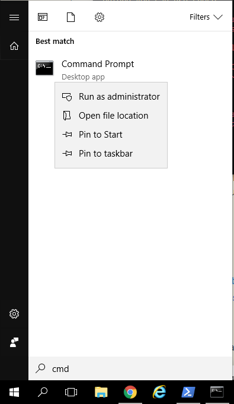
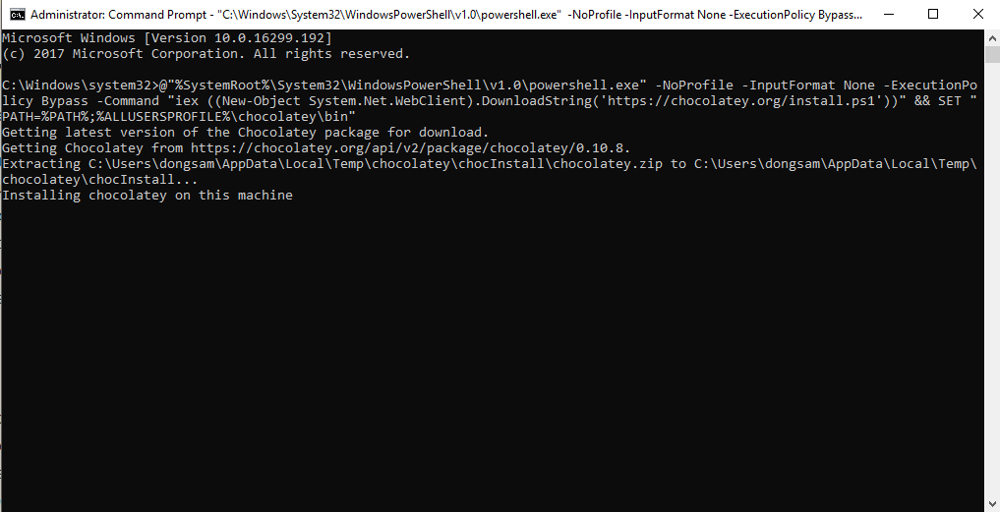
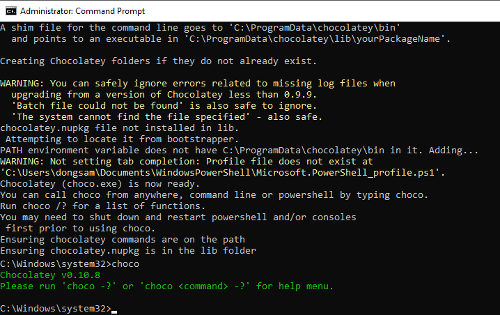

# Windows

### Install Geth

Windows 의 경우 직접 Geth 를 Compile 하지 않고 간단히 설치파일(.exe) 를 통해 설치 가능하다. 

- https://geth.ethereum.org/downloads/ 방문
- 
- Geth for Windows 를 다운받아 실행한다.
- 
- 설치 하는 김에 Development tools 도 함께 설치해준다 ( `abigen`, `bootnode`, `disasm`, `evm`, `rlpdump` 등 포함)
- 
- 설치 완료 후 cmd 에서 geth 명령 실행시 위와 같이 정상적으로 ethereum node 가 실행되면 성공이다. 

### Install Chocolate

Chocolatey 는 Ubuntu 의 apt-get 과 같은 Windows 의 Package 설치, 관리 Tool 이다. Geth 외에도 node, npm, solc, truffle, ganache 등 설치를 할 때 필요하므로 미리 설치해 둔다.

- https://chocolatey.org/install 방문

requirements

- Windows 7+ / Windows Server 2003+
- PowerShell v2+
- .NET Framework 4+

cmd 를 통한 설치 

- CMD 를 `관리자 권한`으로(꼭) 실행 
- 
- `@"%SystemRoot%\System32\WindowsPowerShell\v1.0\powershell.exe" -NoProfile -InputFormat None -ExecutionPolicy Bypass -Command "iex ((New-Object System.Net.WebClient).DownloadString('https://chocolatey.org/install.ps1'))" && SET "PATH=%PATH%;%ALLUSERSPROFILE%\chocolatey\bin"`
- cmd 에 위 명령 입력
- 
- 
- 정상적으로 설치 완료 후 위와 같이 choco 명령이 가능해 진다

직접 Geth 를 컴파일하고 싶다면 https://github.com/ethereum/go-ethereum/wiki/Installation-instructions-for-Windows 링크를 참조하여 choco 를 통해 설치 가능하다.

